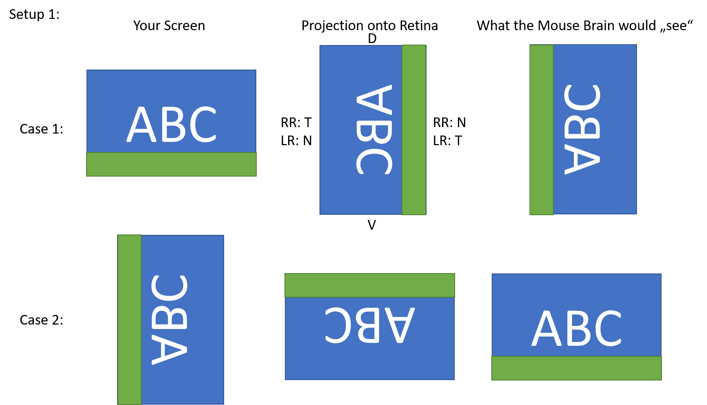
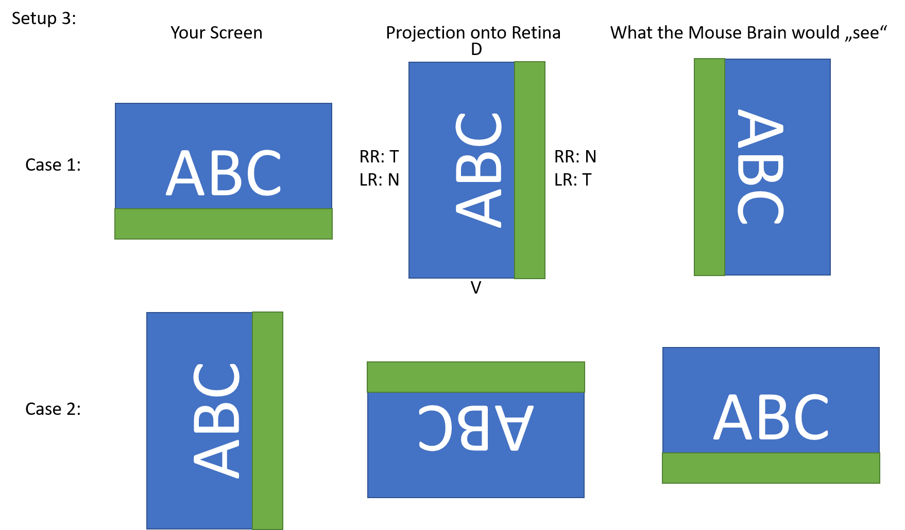
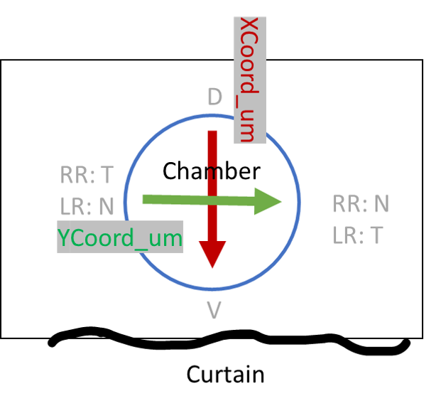
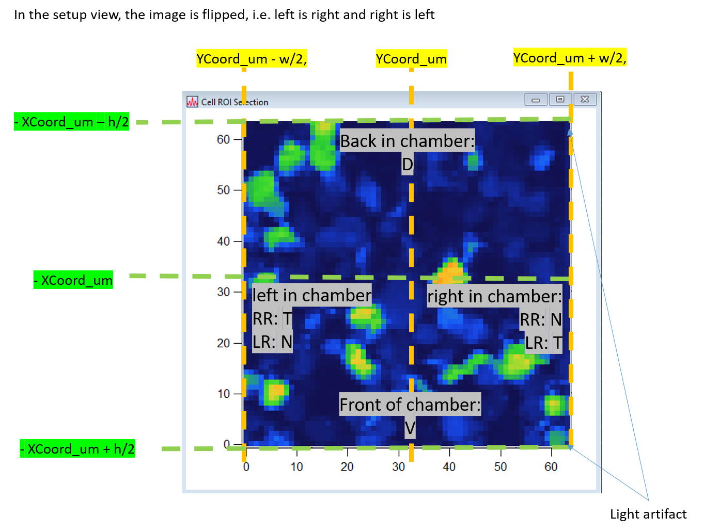
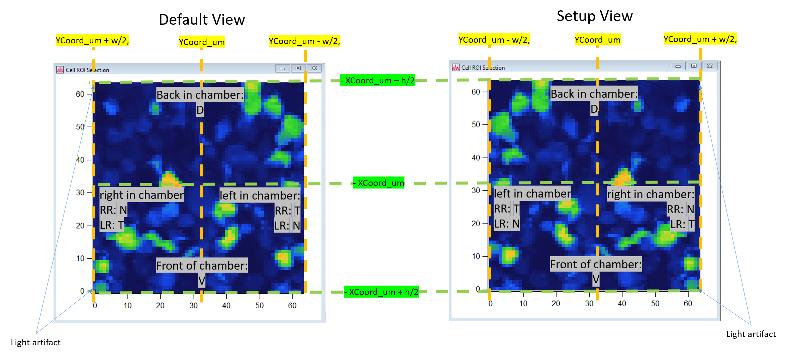

# Stimulus plots

This repository summarizes commonly used stimuli in the Euler Lab and was created for the All-GCL dataset.
For each stimulus it provides the original QDSpy files, QDSpy export files (i.e. if you save a stimulus to numpy using QDSpy directly), and setup adjusted outputs created in jupyter notebooks.

The notebooks in this repository produce numpy arrays that can be used to represent the stimuli as shown at the different setups.
Note that matplotlib imshow uses the (vertical, horizontal) format, with the vertical axis going from top to bottom and the horizontal from left to right.  
This is currently assumed to be the target output.

# Background

## Setups

The Euler Lab has two activate setups that are called setup 1 (S1) and setup 3 (S3).
Setup 2 (S2) also exists but was rarely used and is currently (as of 05-2026) under construction.
In many ways these setups are the comparable, but they have some noteable differences.

### Objective

S1 and S3 are equipped with different objectives.
A standard recording on S1 uses a 16x objective.
A standard recording on S3 uses a 20x objective.

The standard zoom is adjusted, such that the field-of-view is comparable between the two setups (approximately 100 µm x 100 µm).

### Color mapping

The color mapping from the input (typically interpreted as RGB) to the two output LEDs (green and UV) is different for S1 and S3.
For S1 the mapping is from [R, G, B] to [None, Green, UV] (so basically unchanged).
For S3 the mapping is from [R, G, B] to [UV, Green, None] (so basically flipped).

### Orientation

S1 and S3 have different stimulus orientations.
[These two stimuli](wiki/Test_orientation.zip) can get used to test the stimulus orientation on a setup.

Between 2022 and today (05-2026) the orientation of the stimulus as seen by the retina were as follows:
S1:
- MB0_deg: goes from front (ventral / curtain) to back (dorsal)
- MB90_deg: goes from right to left

Setup 3:
- MB0_deg: goes from back (dorsal) to front (ventral / curtain)
- MB90_deg: goes from right to left

If you design a stimulus in QDSpy you can check its orienation by playing these stimuli and your stimulus. Per default the stimulus will look as follows in QDSPy on your own screen:
- MB0_deg: goes from right to left
- MB90_deg: goes from bottom to top

Here are visual explanations on how your stimulus will therefore look on the retina:
S1:

S3:

## Igor
Igor (ScanM) will save the absolute positions of the recording in XCoord_um and YCoord_um.  
This is how these axes are relative to the chamber and retina:

So if you subtract the position of the optic-disk to go from absolute values for XCoord_um and YCoord_um to relative values rel_XCoord_um and rel_YCoord_um:
- rel_XCoord_um < 0 means dorsal
- rel_XCoord_um > 0 means ventral
- rel_YCoord_um < 0 means temporal (right retina) or nasal (left retina)
- rel_YCoord_um > 0 means nasal (right retina) or temporal (left retina)

If you open a ScanM file in Igor on your computer and display it with e.g. Automated Cell Lab, it will look something like this (the colormap and contrast will be different per default). The center coordinates (which is also the stimulus center) will be like this. Note the flip of x and y and the signs:

In the setup rooms there is another flip of left and right to align what you see on the screen with the chamber: On the setup PCs (setup 1 and setup 3), the light artifact will appear on the right, whereas the light artifact will be on the left if you open the files on your PC.

